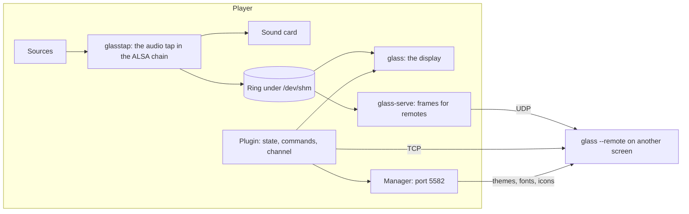

# Glass

VU meters, spectrum analysers, turntables and cassette decks on a Volumio player's screen, moving with the music. Glass is a Volumio plugin with a native display, written in Rust: the theme format of PeppyMeter Screensaver, painted with about half the processor time and a tenth of the memory; an audio tap that measures every source, files, radio, streaming, AirPlay and Spotify alike, without touching the sound; a manager page for themes, the catalog, artwork, backups and upgrades; and remote displays on other screens over the network.

The workspace version is **0.7.5**.

## Get it

The [Quick Start](https://github.com/foonerd/glass/wiki/Quick-Start) on the wiki installs the plugin from the [releases](https://github.com/foonerd/glass/releases) and takes it from there. The wiki is the documentation: [Settings](https://github.com/foonerd/glass/wiki/Settings), the [Manager](https://github.com/foonerd/glass/wiki/Manager), [Themes](https://github.com/foonerd/glass/wiki/Themes) and the [meters.txt reference](https://github.com/foonerd/glass/wiki/Meters-Reference), the [Catalog](https://github.com/foonerd/glass/wiki/Catalog), [Backups](https://github.com/foonerd/glass/wiki/Backups), [Remotes](https://github.com/foonerd/glass/wiki/Remotes), [Troubleshooting](https://github.com/foonerd/glass/wiki/Troubleshooting).

| Player | Volumio 4 on a Raspberry Pi 3, 4, 5 or Zero 2 W, or a PC. |
| --- | --- |
| Screen | Anything the Touch Display plugin drives, or none: a player without a screen serves remote displays. |
| Remote display | Any Linux machine with a screen, from the same release archive. |

## What is in the box

| Part | Where | What it does |
| --- | --- | --- |
| `lead` | `crates/lead` | Reads the configuration and a theme into a skin description: sizes, angles, boxes, keys. |
| `intake` | `crates/intake` | The sources of a frame: the tap's ring or the wire, the player's state over the channel, album art, fanart, the meter rotation, the remote's sync. |
| `plot` | `crates/plot` | Pure: from a skin and one input to a scene, the geometry of everything drawn. Replayable in tests without a display. |
| `expose` | `crates/expose` | Rasters a scene: pictures, fonts, needles, bars, turning pictures, fades; only the boxes that changed. |
| `pane` | `crates/pane` | The window: SDL2, full screen or windowed, a streaming texture, touch. |
| `tap` and `glasstap` | `crates/tap`, `bins/glasstap` | The ALSA PCM plugin that heads the player's chain, passes every stream through byte for byte, PCM, DoP and native DSD, and measures it on its own thread into the ring. |
| `glass` | `bins/glass` | The display: reads the ring and the player's state, draws at the frame rate, uploads when `DISPLAY` is set. As `glass --remote`, the same display on another machine, with its own settings page. |
| `glass-serve` | `bins/glass-serve` | Sends the ring's frames to subscribed remotes over UDP. |
| `tapdump` | `bins/tapdump` | Reads the ring from the command line. |
| The plugin | `plugin/` | The Volumio plugin: the settings page, the audio path, the channel to the display, the manager, remotes, upgrades. `plugin/README.md` says what is in it. |
| The remote installer | `remote/` | Desktop entries, an icon and a user service for a Linux machine used as a remote display. |

## The display from the command line

`glass` runs without the plugin to review themes: `--list` names the installed themes and their meters; `--theme`, `--meter`, `--interval` and `--fps` stand in for the configuration's values; `--once --headless --output frame.png` writes one frame; `--snapshot DIR` writes every meter of a theme, and `--thumb` a thumbnail of each; `--record` writes the skin, input and scene of a frame as JSON; `--print` prints the levels. `GLASS_PROFILE` in the environment prints where each frame's time goes. `glass --remote` runs as a remote display; the wiki's Remotes page has its switches and settings.

## Building

`scripts/check.sh` runs what CI runs: formatting, clippy with warnings denied, the tests, the documentation, the ALSA templates, and the plugin's tests. `scripts/ship.sh` cross builds the display, the daemon, `tapdump` and the tap for `x64`, `armv7` and `armv8` into `bin/<arch>` and `lib/<arch>` (not committed), against Volumio's glibc, and refuses a binary that needs a newer one. `scripts/package.sh` assembles the plugin zip Volumio installs. `scripts/tap_exact.sh` proves the tap passes every format through byte for byte. The toolchain is pinned in `rust-toolchain.toml`. Every version tag publishes the plugin zip and per-architecture archives, each with the remote installer, as release assets.

## Standards

Commits use [Conventional Commits](https://www.conventionalcommits.org/en/v1.0.0/). Versions use [Semantic Versioning](https://semver.org/spec/v2.0.0.html), and every cut bumps the patch. The wiki's Standards page has the rules, and its Contracts page the ring's layout and the theme keys as drawn.

## Licence

See `LICENSE`. The themes bundled with the plugin are PeppyMeter's and PeppySpectrum's, by their authors; the community themes are in [peppy_templates](https://github.com/foonerd/peppy_templates).
