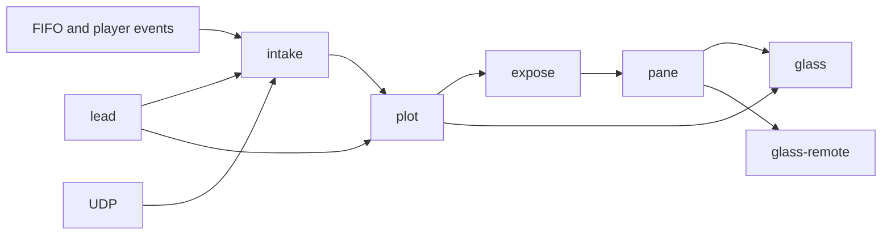
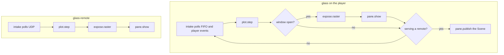

# Glass

Glass is the surface a player shows, and later the surface you touch. It paints what is playing. The same glass will take reactive controls. It is an interface, not a screensaver.

This file is the blueprint: the agreed shape of the project. Procedures, protocols, skin keys, and measurements live in the wiki.

The workspace version is **0.7.0**. The player reads the tap's ring and the player's state, from the plugin's channel or by asking the player, rasters one frame, and uploads it when `DISPLAY` is set. `--remote <player>` runs the same display on another machine: the player's configuration, theme, fonts and icons are brought from the plugin's manager, the frames come over the network from `glass-serve` on the player, and the wiki's Remotes page has the wire. The plugin's manager, a web application on the player's port 5582, holds what manages the display: themes with previews the display draws, the theme catalog, uploads, artwork, backups, Glass's own upgrades, the remotes, and a status page; the wiki's Manager page has its API. `--headless` skips the window. `--output` writes a PNG or PPM. `--list`, `--theme`, `--meter`, `--interval`, `--fps`, `--threads` and `--snapshot` review the installed themes without touching the player's configuration; the wiki's Tests page has the workflow. The audio tap, `glasstap`, is an ALSA PCM plugin in the `tap` crate and the `glasstap` library: every source's stream passes through it byte for byte, PCM, DoP and native DSD alike, and is measured on the way, and the peak, RMS and spectrum, or the density level of one-bit audio, go through a ring under `/dev/shm`; `scripts/tap_exact.sh` proves the pass-through, and the wiki's Contracts page has the layout. `scripts/ship.sh` cross-builds the display, the tap and `tapdump` into `bin/<arch>` and `lib/<arch>`, which are not committed. Glass ships as a Volumio plugin: `plugin/` holds it and `scripts/package.sh` builds the zip Volumio installs, with the display binaries, the ALSA scope and the node modules; `plugin/README.md` says what is in it. Glass replaces PeppyMeter Screensaver and takes its themes and settings over. `scripts/check.sh` runs what CI runs: formatting, clippy with warnings denied, the tests and the documentation; the toolchain is pinned in `rust-toolchain.toml`. Every version tag publishes the plugin zip and per-architecture archives as release assets. Commits use [Conventional Commits](https://www.conventionalcommits.org/en/v1.0.0/). Versions use [Semantic Versioning](https://semver.org/spec/v2.0.0.html). The rules are in the wiki under Standards.

## Where the words live

| Place | Holds |
| --- | --- |
| This README | The design we agreed. Names, stations, and what must stay still. |
| [Wiki](https://github.com/foonerd/glass/wiki) | Technical detail. Clone it as `glass.wiki` once the first page exists. |

The wiki is cloned beside this repo as `glass.wiki`.

## The line

Work moves one way. A station reads the previous station's types and does not reach sideways. `lead` is the shared types on those leads. It opens nothing and draws nothing.



`plot → player` is the headless path: the scene is published and never rastered.

## Stations

| Crate | Reads | Writes | Does not |
| --- | --- | --- | --- |
| `lead` | Bytes, skin text | Levels, bins, metadata, skin description | Open a device, draw |
| `intake` | FIFO, player events, UDP | One `Input` | Parse skin geometry, draw |
| `plot` | `Input` and a skin | A `Scene`: angles, bar heights, layers | Read devices, touch a display |
| `expose` | `Scene` and image files | One RGBA frame | Poll audio, talk to the player |
| `pane` | A frame, or a scene | A display upload, or a UDP publish | Decide a needle angle or a bar height |

`expose` is the costly station. It finishes one picture. `pane` puts that picture on the glass in one upload.

## Two ends

Both binaries run the same stations. The source differs.



Headless mode is the player with the window closed. It stops before `expose`.

## Repository

```text
glass/
  crates/lead
  crates/intake
  crates/plot
  crates/expose
  crates/pane
  bins/glass
  bins/glass-remote
  plugin/                 Volumio plugin slot. It will start the glass binary.
  native/alsa-scope/      C writer of meter and spectrum frames.
  testdata/frames/        Recorded inputs and the Scene they must produce.
```

Skins, fonts, and pictures stay files on disk. `plot` reads their description. `expose` reads their pixels.

## What stays still

These are installed contracts. Glass consumes them. Changing them is a separate migration, not part of standing the line up.

- The ALSA scope writes the meter FIFO and the spectrum FIFO. Glass reads the latest frame and discards the rest.
- The Volumio plugin remains the process that decides when the player binary runs.
- Skin files and fonts remain data, addressed by path.

## Tests that lock the blueprint

`plot` is a pure function, so a recorded `Input` has one expected `Scene`. Those pairs live in `testdata/frames/`. A display is not required to prove the scene. Pixel comparison against `expose` comes after the scene tests are green.
